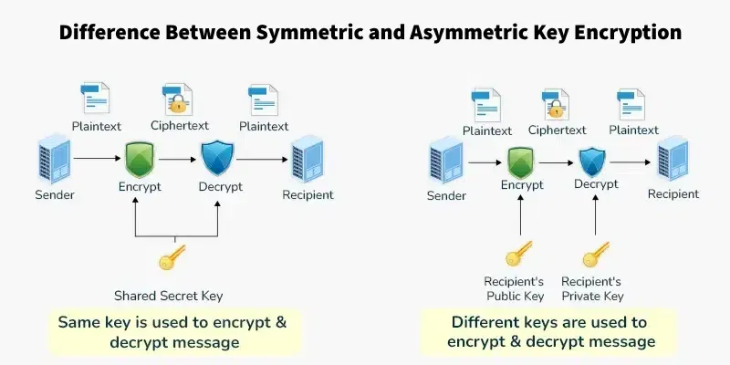

# Cryptography Basics

Cryptography is the practice of securing information by converting it into a protected format so that only authorized users can access it. It plays a critical role in protecting data confidentiality, integrity, and secure communication.

---

## 1. Symmetric vs Asymmetric Encryption

### Symmetric Encryption

Symmetric encryption uses the same key for both encryption and decryption.

- Faster and efficient
- Suitable for encrypting large amounts of data
- The main challenge is securely sharing the secret key

Example:
AES (Advanced Encryption Standard)

If the key is exposed, anyone can decrypt the data.

---

### Asymmetric Encryption

Asymmetric encryption uses two keys:
- Public Key (used to encrypt data)
- Private Key (used to decrypt data)

- More secure for key exchange
- Slower compared to symmetric encryption

Example:
RSA (Rivest–Shamir–Adleman)

Asymmetric encryption is commonly used for secure communication over the internet.

  

---

## 2. Hashing (MD5, SHA256)

Hashing is a one-way process that converts data into a fixed-length string called a hash value. Unlike encryption, hashing cannot be reversed.

### MD5 (Message Digest 5)

- Produces a 128-bit hash value
- Faster but considered weak
- Vulnerable to collision attacks

Because of security weaknesses, MD5 is no longer recommended for sensitive applications.

---

### SHA256 (Secure Hash Algorithm 256-bit)

- Produces a 256-bit hash value
- More secure than MD5
- Commonly used for password storage and digital signatures

Hashing is mainly used to ensure data integrity and verify that data has not been altered.

---

## 3. Digital Certificates & SSL/TLS

### Digital Certificates

A digital certificate verifies the identity of a website or organization. It is issued by a trusted Certificate Authority (CA).

It contains:
- Public key
- Website information
- Certificate Authority details

Digital certificates help users confirm they are communicating with legitimate servers.

---

### SSL/TLS

SSL (Secure Sockets Layer) and TLS (Transport Layer Security) are protocols used to encrypt communication between a client and server.

- HTTPS uses SSL/TLS
- Protects data from interception
- Ensures confidentiality and integrity

When a user visits a secure website (https://), SSL/TLS encrypts the transmitted data.

---

## 4. Hands-on Practice Using OpenSSL

OpenSSL is a tool used for encryption and cryptographic operations in Linux.

### Step 1: Create a Sample File

    echo "This is a secret message" > secret.txt

---

### Step 2: Encrypt the File

    openssl enc -aes-256-cbc -in secret.txt -out encrypted.txt

You will be asked to set a password for encryption.

---

### Step 3: Decrypt the File

    openssl enc -aes-256-cbc -d -in encrypted.txt -out decrypted.txt

After entering the correct password, the original message will be restored.
