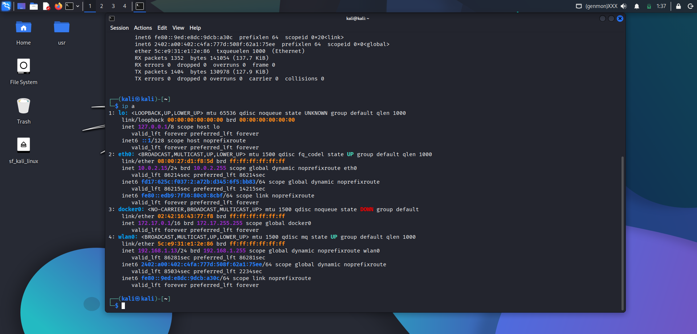
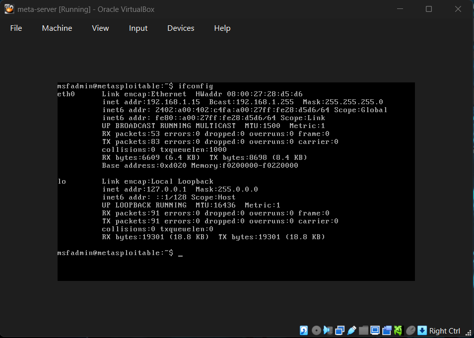
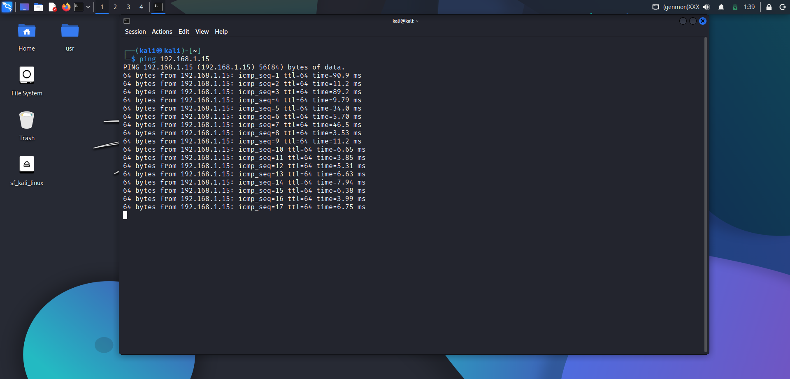
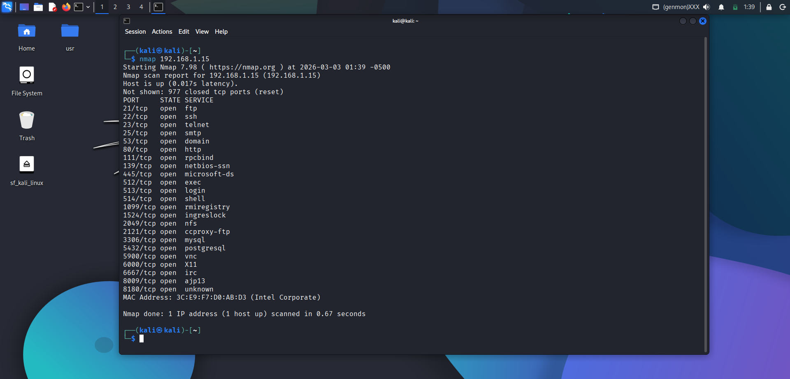
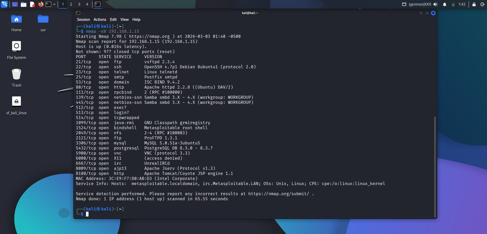
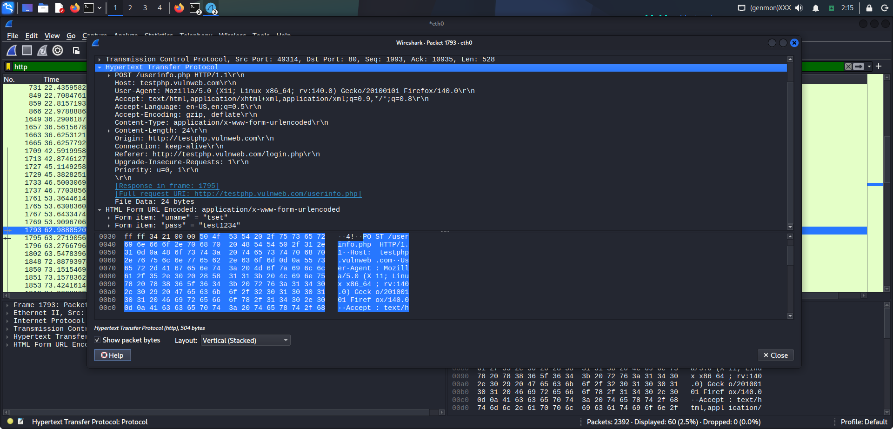
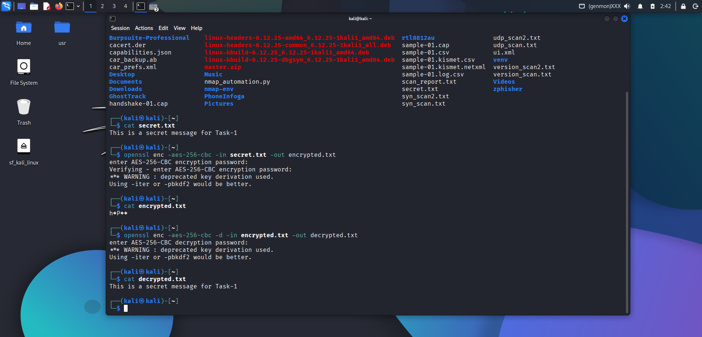

# Lab Setup Report – Task 1

## Objective

The objective of this lab was to build a controlled cybersecurity testing environment using virtual machines and perform basic reconnaissance, traffic analysis, and encryption demonstrations in a safe and isolated network.

---

# 1. Lab Architecture

## Virtualization Platform
- Oracle VirtualBox

## Machines Used
- Attacker Machine: Kali Linux
- Target Machine: Metasploitable 2

## Network Configuration
- Host-Only Adapter
- Both machines configured in the same subnet

This setup ensures isolated testing without affecting external systems.

---

# 2. IP Address Configuration

## Kali Linux IP Verification

Command used:

ip a

Observation:
Kali Linux was assigned a valid IP address in the Host-Only network range.

---

## Metasploitable IP Verification

Command used:

    ifconfig

Observation:
Metasploitable was successfully configured in the same subnet as Kali Linux.

---

# 3. Connectivity Verification

To verify communication between attacker and target:

    ping <target-ip>

Observation:
Successful ICMP replies confirmed proper network connectivity.

---

# 4. Network Scanning Using Nmap

## Basic Port Scan

    nmap <target-ip>

Result:
Multiple open ports were identified on the target machine.

---

## Service Version Detection

    nmap -sV <target-ip>

Observation:
The scan revealed running services including:
- FTP
- SSH
- Telnet
- HTTP
- MySQL
- SMB

Some services appeared outdated, indicating potential vulnerabilities.

---

# 5. Packet Capture Using Wireshark

Wireshark was used to analyze network traffic.

Filter applied:

    http

Observation:
During a login attempt on a vulnerable web application, credentials were captured in plaintext.

This demonstrates:
- HTTP does not encrypt data.
- HTTPS is necessary for secure communication.

---

# 6. Cryptography Demonstration Using OpenSSL

## Step 1 – Create a File

    echo "This is a secret message for Task-1" > secret.txt

## Step 2 – Encrypt the File

    openssl enc -aes-256-cbc -in secret.txt -out encrypted.txt

## Step 3 – Decrypt the File

    openssl enc -aes-256-cbc -d -in encrypted.txt -out decrypted.txt

Observation:
The file was successfully encrypted and decrypted using the same key, demonstrating symmetric encryption.

---

# Conclusion

This lab successfully demonstrated:

- Setup of an isolated cybersecurity testing environment
- Verification of network communication between machines
- Service enumeration using Nmap
- Traffic analysis using Wireshark
- Practical encryption and decryption using OpenSSL

The lab provides a strong foundation for advanced penetration testing and cybersecurity analysis.

