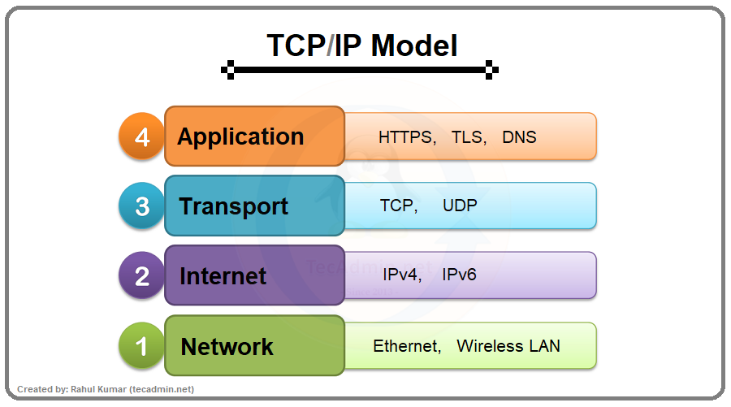

# Networking Basics

Networking is the foundation of cybersecurity. Every cyber attack travels through a network, so understanding how systems communicate helps in identifying vulnerabilities and securing communication channels.

---

## 1. OSI Model (Open Systems Interconnection Model)

The OSI model is a 7-layer conceptual framework used to understand how data travels from one device to another across a network.

  

<em><b> Figure 1: OSI Model 7 Layers</b></em>

### Layer 1 – Physical
This layer deals with physical components like cables, switches, and electrical signals that transmit raw data.

### Layer 2 – Data Link
Responsible for MAC addressing and error detection. It ensures reliable communication between devices on the same network.

### Layer 3 – Network
Handles logical addressing using IP addresses and routes data between different networks.

### Layer 4 – Transport
Ensures proper data delivery using TCP or UDP protocols. It manages reliability, flow control, and error correction.

### Layer 5 – Session
Manages sessions between applications by establishing, maintaining, and terminating connections.

### Layer 6 – Presentation
Handles data formatting, encryption, and compression before transmission.

### Layer 7 – Application
Provides services directly to end users such as HTTP, FTP, DNS, and SMTP.

The OSI model helps in troubleshooting and understanding how different networking components interact.

---

## 2. TCP/IP Protocol Suite

The TCP/IP model is the practical networking model used on the internet. It consists of four layers:

  

<em><b> Figure 2: TCP/IP Model 4 Layers</b></em>

---

### Application Layer
Includes protocols like HTTP, HTTPS, DNS, FTP, and SMTP. This layer interacts directly with user applications.

### Transport Layer
Uses:
- **TCP (Transmission Control Protocol)** – Reliable and connection-oriented. Ensures data is delivered correctly.
- **UDP (User Datagram Protocol)** – Faster but connectionless. Does not guarantee delivery.

### Internet Layer
Responsible for IP addressing and routing data across networks.

### Network Access Layer
Handles physical transmission and communication within local networks.

TCP/IP is the backbone of internet communication.

---

## 3. DNS & HTTP/HTTPS

### DNS (Domain Name System)

DNS converts human-readable domain names into IP addresses.

For example, when a user enters `google.com` in a browser, DNS translates it into an IP address so the system can locate the correct server.

Without DNS, users would need to remember numeric IP addresses.

---

### HTTP (Hypertext Transfer Protocol)

HTTP is a protocol used for transferring web data between a client and a server.

- Operates on Port 80
- Data is sent in plain text

Because HTTP is not encrypted, data can be intercepted.

---

### HTTPS (Hypertext Transfer Protocol Secure)

HTTPS is the secure version of HTTP.

- Operates on Port 443
- Uses SSL/TLS encryption
- Protects data from interception

HTTPS ensures confidentiality and integrity during web communication.

---

## 4. IP Addressing, Subnetting, and NAT

### IP Addressing

An IP address uniquely identifies a device on a network.

Two types:
- IPv4 (e.g., 192.168.1.10)
- IPv6 (long hexadecimal format)

IP addresses can be:
- Public IP (used on the internet)
- Private IP (used inside local networks)

---

### Subnetting

Subnetting divides a large network into smaller networks to improve performance and security. It helps in better network management and reduces broadcast traffic.

Example:
192.168.1.0/24 can be divided into smaller subnets.

---

### NAT (Network Address Translation)

NAT allows multiple devices in a private network to share a single public IP address.

It is commonly used in home and office routers. NAT improves security by hiding internal IP addresses from the public internet.
